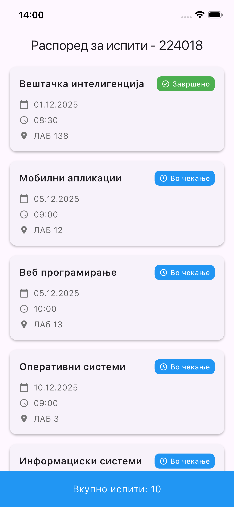
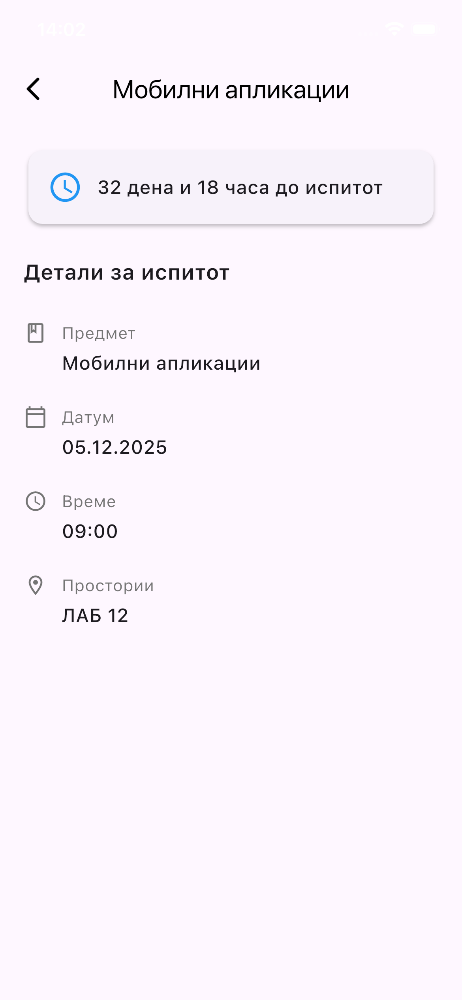
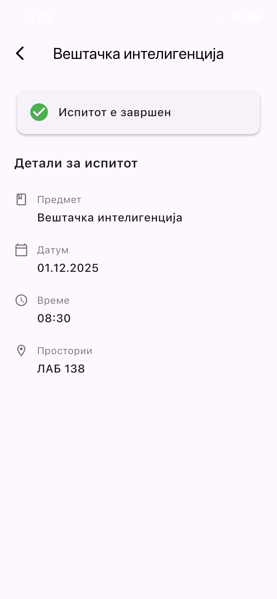

# 📅 Exam Scheduler  

A **Flutter mobile application** for organizing and tracking exam schedules — helping students easily plan, view, and manage their upcoming exams.  

## ✨ Features  
- View all upcoming and completed exams in a list
- Check the status of each exam (completed or pending)

## 🛠️ Tech Stack  
- **Framework:** Flutter (Dart)

## 🖼️ Screens
- **Home screen**

- **Exam details screen**

- **Passed exam details screen**
